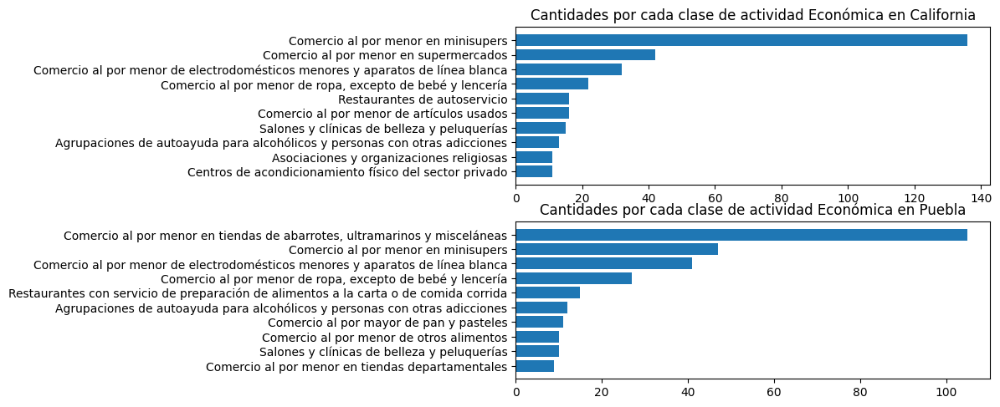
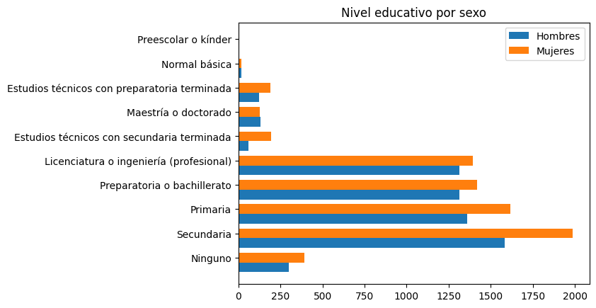
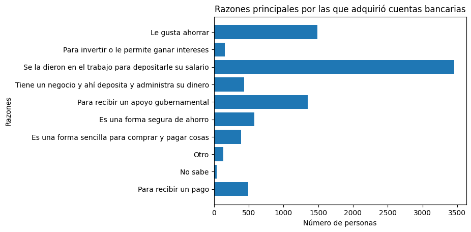
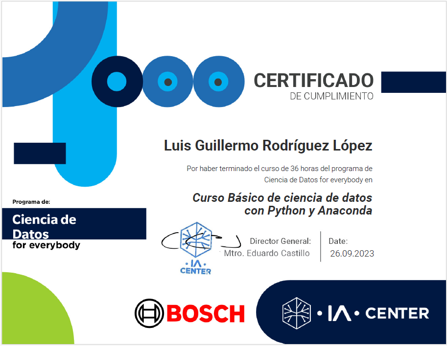

# Information:

In this Basic Data Science with Python and Anaconda course, taught by IA-Center in collaboration with BOSHC, we were asked to complete several challenges (or practical exercises) related to data preprocessing and analysis.

* [Challenge 1](./Challenge1/Tarea1.ipynb). We were given a dataset containing disorganized date information. The goal was to deliver the dataset in a clean, understandable CSV format with properly separated data. The second part involved reading multiple CSV files at once and combining them into a single DataFrame.

* [Challenge 2](./Challenge2/Challenge_2.ipynb). We were asked to query the **DENUE API** (Directorio Estadístico Nacional de Unidades Económicas) from INEGI, in order to perform data analysis of the economic activities from two selected Mexican states and compare them:

* [Challenge 3](./Challenge3/Challenge_3.ipynb). This challenge involved preprocessing/cleaning a CSV file containing information about various Airbnb listings, **focusing more on the methods and functions from the pandas library**, since working with large datasets without this can quickly lead to out-of-memory (OOM) issues. This cleaning task was more extensive than in Challenge 1 and included: handling NaN values, Formatting date fields, Applying numerical filters, Analyzing duplicate entries etc.

* [Final Challenge](./Challenge_Final/Challenge_Final_COMPLETADO.ipynb). We were provided with several CSV data dictionaries from Encuesta Nacional de Inclusión Financiera 2021 (ENIF). The goal was to perform data visualizations (using **Matplotlib**) and data analysis to answer a variety of questions, such as: What is the age distribution by gender?
How many women and men are represented in the data? What is the overall age distribution? As this was the final challenge, the analysis was more comprehensive. Part of the challenge involved creating functions to keep the code clean and avoid repetition. Some of the visualizations produced include:

